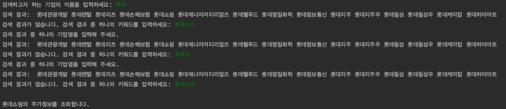

# Stock-Info-Viewer
__국내 주식 차트 조회 프로그램__

상명대학교 1-2 교양 '알고리즘과 게임 컨텐츠' 수업 팀 프로젝트입니다.

__함수 설명을 모두 DocString으로 주석화하여, 코드를 통해 쉽게 그 쓰임새를 파악할 수 있습니다.__

## 실행 시

1. 프로그램 실행 시 다음과 같은 문구가 실행되면, 정상 실행된 것입니다. pykrx 라이브러리를 이용, 주식 정보를 스크랩합니다. 


2. 스크랩과 초기 세팅이 완료되면, 다음과 같이 조회를 원하는 기업명을 입력합니다. KOSPI 상장 기업만 검색이 가능합니다.



3. 조회 기업을 선택한 후, 원하는 조회 기간을 입력합니다. 단위는 일(Day) 단위입니다.
<br>예를 들어 '20'을 입력할 경우, 조회 당일로부터 20일 전부터 조회 당일까지의 기간 중 한국거래소 영업일의 주식 차트를 표시합니다.


4. 조회 기간을 입력하면, 아래 그림과 같이 원 단위로 표시된 선택 기업 주식의 CandleStick Chart(봉차트)가 유저가 입력한 정보와 함께 표시됩니다.


5. 차트 출력이 성공적으로 끝난 경우 유저가 입력한 기업명, 기간이 포함된 아래와 같은 메시지가 출력됩니다. 


6. (Updated) 추가로 유저가 입력한 기업명의 최근 영업일자에 평가된 BPS, PER, PBR, EPS, DIV, DPS 정보가 표시됩니다. 투자 적절성 판단에 사용할 수 있습니다.


## 개발 환경 세팅
다음 명령어를 통해 requirements.txt에 명시된 사용 라이브러리를 한번에 설치할 수 있습니다.

```$ pip freeze > requirements.txt```

## 사용한 라이브러리

### 내장 라이브러리
* datetime - datetime, timedelta

### 외부 라이브러리
* pykrx - stock
* pandas
* matplotlib - pyplot, gridspec
* mpl_finance - candlestick2_ohlc

## 참고

* PyKrx(KRX 주식 정보 스크래핑) 라이브러리 Github Repository
<br>https://github.com/sharebook-kr/pykrx
* mpl_finance 라이브러리 pypi 페이지
<br> https://pypi.org/project/mpl-finance/